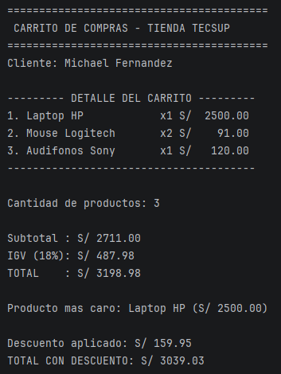

# Laboratorio 02 - Carrito de Compras en Kotlin

## Datos del estudiante

**Nombre:** Michael Fernandez


## Descripción del proyecto

Este proyecto consiste en desarrollar un carrito de compras utilizando Kotlin mediante programación por consola.

El programa permite registrar productos, calcular el subtotal de compra, calcular el IGV del 18%, obtener el total, mostrar un reporte detallado del carrito, identificar el producto más caro y aplicar descuentos según el monto total de compra.


## Funciones implementadas

Las funciones principales desarrolladas en el laboratorio son:

### calcularSubtotal()

Calcula el subtotal de los productos multiplicando el precio por la cantidad de cada producto.

### calcularIGV()

Calcula el IGV correspondiente al 18% del subtotal.

### calcularTotal()

Obtiene el total de la compra sumando el subtotal más el IGV.

### mostrarDetalle()

Muestra los productos del carrito con cantidades e importes utilizando formato de columnas alineadas.

### calcularDescuento()

Aplica descuentos según el monto total utilizando la estructura de decisión `when`.

- Más de S/ 5000 → descuento del 10%.
- Más de S/ 3000 → descuento del 5%.
- Menor o igual a S/ 3000 → sin descuento.


### Producto más caro

Se utiliza `maxByOrNull` para identificar el producto con mayor precio dentro del carrito.


### Diferencia entre val y var

En Kotlin:

- val declara una variable cuyo valor no puede cambiar después de ser asignado.
- var declara una variable cuyo valor sí puede modificarse.

---

# Modelo de datos

El producto fue representado mediante una `data class`:

```kotlin
data class Producto(
    val nombre: String,
    val precio: Double,
    var cantidad: Int
)
```

