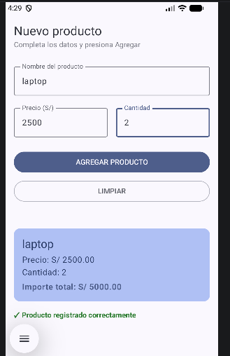
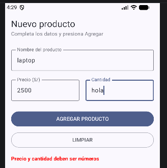

# Lab03RegistroProducto

## Descripción

Aplicación Android desarrollada con Jetpack Compose para el registro de productos.

Permite ingresar:
- Nombre del producto.
- Precio.
- Cantidad.

Además calcula el importe total y muestra un resumen mediante una Card.

---

# Capturas de funcionamiento

## Registro correcto de producto

La aplicación permite registrar un producto mostrando el resumen con:
- Nombre.
- Precio.
- Cantidad.
- Importe total calculado.

## Validación de datos incorrectos

Cuando el usuario ingresa datos no válidos, la aplicación muestra un mensaje de error en rojo y evita mostrar la Card.

---

# Mejora con IA

## Implementación realizada con Gemini

La mejora fue realizada dentro de la rama `con-ia`.

| Prompt que usé | Qué generó Gemini | Qué acepté o corregí |
|---|---|---|
| Agregar validación de campos vacíos en PantallaRegistro. Si falta un dato al presionar AGREGAR PRODUCTO, mostrar un mensaje de error en rojo en lugar de la Card. Agregar también un botón LIMPIAR que vacíe el formulario sin modificar el diseño existente. | Gemini agregó la variable `mensajeError`, validación de campos vacíos, mensaje de error en rojo y botón LIMPIAR para limpiar el formulario. | Se aceptó la estructura generada por Gemini y se realizaron ajustes propios en la validación de datos numéricos y mensajes mostrados al usuario. |